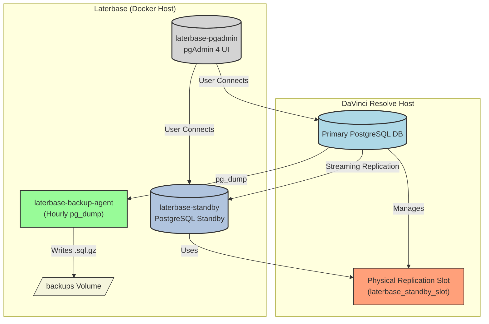

# Laterbase: DaVinci Resolve PostgreSQL Standby, Backup Agent, and pgAdmin Setup

This project, nicknamed "Laterbase", sets up a Docker-based environment specifically designed for **DaVinci Resolve PostgreSQL databases**. It consists of:

1.  **PostgreSQL Standby Server:** Creates a hot standby replica of your primary DaVinci Resolve PostgreSQL database using streaming replication.
2.  **Hourly Backup Agent:** Performs hourly logical backups (`pg_dump`) of your primary DaVinci Resolve database.
3.  **pgAdmin 4 UI:** Provides a web-based graphical interface for managing and monitoring both the primary DaVinci Resolve database and the standby replica.

<p align="center">
  
</p>

## Architecture Overview

This diagram shows how the Laterbase components interact with your primary DaVinci Resolve PostgreSQL database:



**Note on Physical Replication Slot:** A physical replication slot (`laterbase_standby_slot` in this setup) is a feature on the primary PostgreSQL server. It ensures that the primary server retains the necessary transaction logs (WAL segments) required by the standby server, even if the standby disconnects temporarily. This prevents the standby from falling too far behind and needing a full resynchronization.

## Configuration
1.  **`.env` File:**
    *   Open the `.env` file.
    *   Set `PRIMARY_HOST` to the hostname or IP address of your main **DaVinci Resolve** PostgreSQL server.
    *   Set `REPL_PASSWORD` to the password for the `postgres` user (or your designated replication user) on the primary DaVinci Resolve server.
    *   **Crucially:** Replace `YOUR_LATERBASE_PRIMARY_DB_NAME_HERE` with the **actual name** of your main **DaVinci Resolve** database on the primary server (e.g., `ResolveProjects`, for backups).
    *   Replace `YOUR_PGADMIN_EMAIL_HERE` with the email address you want to use for the pgAdmin login.
    *   Replace `YOUR_PGADMIN_PASSWORD_HERE` with the password you want for the pgAdmin login.
    *   Adjust `PRIMARY_PORT` or `PRIMARY_USER` if they differ from the defaults (5432, postgres).
    *   Optionally, uncomment and set `POSTGRES_USER`, `POSTGRES_DB`, or `PGDATA` under the "Standby Server Configuration" section to override the defaults used by the standby service.

2.  **Primary PostgreSQL Server Preparation (`PRIMARY_HOST`):**
    * Ensure the target database is marked as shared or accessible on the resolve box

    *   **Replication User:**
        *   Ensure the user specified (`postgres` or `PRIMARY_USER`) exists.
        *   Grant the `REPLICATION` role to the user: `ALTER USER <replication-user> WITH REPLICATION;`
    *   **Replication Slot:**
        *   Connect to the primary database using `psql`.
        *   Create the physical replication slot expected by `setup_standby.sh`:
            ```sql
            SELECT pg_create_physical_replication_slot('laterbase_standby_slot');
            ```
    *   **Reload/Restart PostgreSQL:** Apply the configuration changes on the primary server (e.g., `sudo systemctl reload postgresql` or `sudo systemctl restart postgresql`).

3.  **Create Backup Directory:**
    *   In the same directory as the `docker-compose.yml` file on your Docker host, create the backups directory:
        ```bash
        mkdir backups
        ```

## Usage

1.  **Build and Start Containers:**
    *   Navigate to the project directory in your terminal.
    *   Run:
        ```bash
        docker-compose up --build -d
        ```
2.  **Access pgAdmin:**
    *   Open a web browser and go to `http://<your-docker-host-ip>:5050` (or `http://localhost:5050` if running Docker locally).
    *   Log in using the email and password you configured in the `.env` file.
3.  **Connect Servers in pgAdmin:**
    *   Add a server connection for your **Primary** database (`PRIMARY_HOST`:5432).
    *   Add a server connection for your **Standby** database (`<your-docker-host-ip>`:5433). Use the same user/password as the primary.
4.  **Monitor:**
    *   Use pgAdmin to monitor server status and replication lag (see pgAdmin documentation or previous conversation notes for specific queries like `pg_stat_replication`).
    *   Check the `./backups` directory on the host for hourly `.sql.gz` backup files.
    *   Check container logs using `docker logs laterbase_standby` and `docker logs laterbase_backup_agent`.
5.  **Stop Containers:**
    *   Run:
        ```bash
        docker-compose down

## Files

*   `docker-compose.yml`: Defines the three services (`laterbase-standby`, `laterbase-backup-agent`, `laterbase-pgadmin`), their configurations, volumes, and network.
*   `Dockerfile`: Instructions to build the PostgreSQL standby server image (based on `postgres:15`).
*   `Dockerfile.backup`: Instructions to build the backup agent image (based on Debian, includes `cron` and `postgresql-client`).
*   `.env`: Configuration file for environment variables (database credentials, pgAdmin login, etc.). **Requires user configuration.**
*   `setup_standby.sh`: Script run inside the standby container on first start to perform the initial base backup and configure replication.
*   `backup.sh`: Script run by cron inside the backup agent container to perform hourly `pg_dump` backups.
*   `crontab.txt`: Defines the cron schedule for `backup.sh`.
*   `./backups/` (Directory to be created): Host directory where backup files (`.sql.gz`) will be stored by the backup agent.

