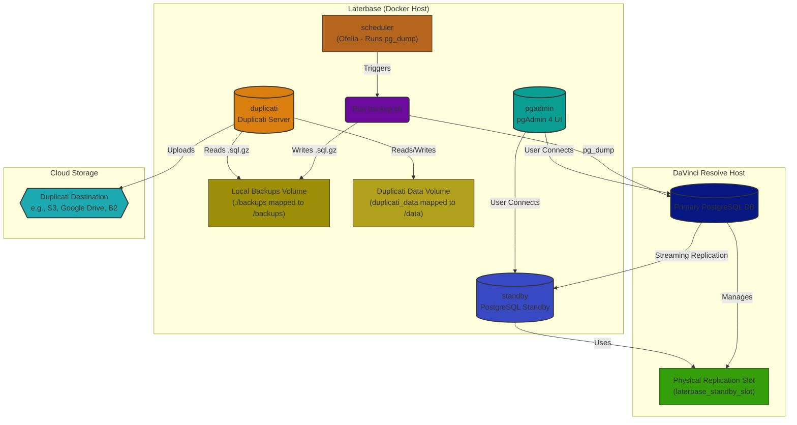

# Laterbase: DaVinci Resolve PostgreSQL Standby, Backup Agent, and pgAdmin Setup

Laterbase, sets up a Docker-based environment specifically designed for **DaVinci Resolve PostgreSQL databases**. It consists of:

1.  **PostgreSQL Standby Server:** Creates a hot standby replica of your primary DaVinci Resolve PostgreSQL database using streaming replication.
2.  **Hourly Backup Agent (`backup-agent`):** Performs hourly logical backups (`pg_dump`) of your primary DaVinci Resolve database(s) into a shared volume (`/backups`). Manages local `.sql.gz` file retention based on `BACKUP_RETENTION_DAYS`. Triggered by the `scheduler` service.
3.  **Duplicati Service (`duplicati`):** Runs the Duplicati server, monitoring the shared `/backups` volume (read-only). Uploads new/changed backup files to your configured cloud storage destination and manages remote retention according to its own job settings. Configured via its web UI.
4.  **pgAdmin 4 UI (`pgadmin`):** Provides a web-based graphical interface for managing and monitoring both the primary DaVinci Resolve database and the standby replica.
5.  **Scheduler (`scheduler`):** Uses Ofelia to trigger the `backup.sh` script inside the `backup-agent` container on an hourly schedule.
3.  **pgAdmin 4 UI:** Provides a web-based graphical interface for managing and monitoring both the primary DaVinci Resolve database and the standby replica.

<p align="center">
  
</p>

## Architecture Overview

This diagram shows how the Laterbase components interact with your primary DaVinci Resolve PostgreSQL database:



**Note on Physical Replication Slot:** A physical replication slot (`laterbase_standby_slot` in this setup) is a feature on the primary PostgreSQL server. It ensures that the primary server retains the necessary transaction logs (WAL segments) required by the standby server, even if the standby disconnects temporarily. This prevents the standby from falling too far behind and needing a full resynchronization.

## Configuration
1.  **Configure `.env` File:**
    *   Copy the `.env.example` file to `.env`.
    *   Edit the `.env` file and fill in the required values (database connection details, pgAdmin credentials, backup settings) according to the comments within the file.

2.  **Primary PostgreSQL Server Preparation (`PRIMARY_HOST`):**

    *   **Ensure DaVinci Resolve Database is Accessible:** Make sure your DaVinci Resolve database is configured to allow network connections if Laterbase is running on a different machine. Check the DaVinci Resolve Project Server settings if applicable.
    *   **Primary Server Configuration Steps (macOS Example):**
        **VERY IMPORTANT:** Configuring the primary server involves both manual file editing and running an automated script. These steps must be completed on your primary macOS (this is usually the machine your resolve is on) (`PRIMARY_HOST`) *before* you attempt to start the main Laterbase Docker containers (`docker-compose up`). Laterbase only configures the standby replica; it does **not** automatically configure your primary server.

        **Step 1: Edit Primary Server's `pg_hba.conf` (Manual Step on Primary)**
            *   On the primary Mac (where DaVinci Resolve's PostgreSQL runs), open Terminal and run the following command. Replace `<VERSION>` with your PostgreSQL version (e.g., 13):
                ```bash
                sudo nano /Library/PostgreSQL/<VERSION>/data/pg_hba.conf
                ```
            *   Add the following line at the end of the file. **Important:** Replace `192.168.1.123/32` with the actual IP address of your Laterbase Docker host. Use the correct `PRIMARY_USER` if it's not `postgres`.
                ```conf
                # Allow replication connections from the Laterbase Docker host
                host    replication     postgres        192.168.1.123/32         md5
                ```
            *   Save the file (`Ctrl+O`, Enter) and exit (`Ctrl+X`).

        **Step 2: Prepare Primary Database (Run Script on Laterbase Host)**
            *   This script prepares the primary database by granting permissions and creating the necessary replication slot (`laterbase_standby_slot`).
            *   Ensure your `.env` file in the Laterbase project directory is correctly configured (especially `PRIMARY_HOST`, `PRIMARY_USER`, `REPL_PASSWORD`).
            *   From the Laterbase project directory (where `docker-compose.yml` is), run this command:
                ```bash
                docker-compose run --rm --no-deps app bash /app/prepare_primary_db.sh
                ```
            *   Check the output for any errors. If this script fails, replication will not work.

        **Step 3: Reload Primary Server Config (Manual Step on Primary)**
            *   After editing `pg_hba.conf` (Step 1), the primary PostgreSQL server needs to reload its configuration.
            *   On the primary Mac, the easiest way is usually to **quit and restart the DaVinci Resolve Project Server application**.
            *   Alternatively, restarting the primary Mac will also work.

        **Step 4: Verify Primary Server is Running**
            *   Make sure the primary PostgreSQL server (and DaVinci Resolve Project Server, if used) is running before starting Laterbase.

3.  **Create Backup Directory:**
    *   In the same directory as the `docker-compose.yml` file on your Docker host, create the backups directory (if using the default `LOCAL_BACKUP_PATH`):
        ```bash
        mkdir backups
        ```


## Usage & configuration of duplicati and pgadmin, 

1.  **Build and Start Containers:**
    *   Navigate to the project directory in your terminal.
    *   Run:
        ```bash
        docker-compose up --build -d
        ```
2.  **Access pgAdmin:**
    *   Open `http://<your-docker-host-ip>:5050` (or `http://localhost:5050`).
    *   Log in using the email/password from `.env`.
3.  **Access Duplicati:**
    *   Open `http://<your-docker-host-ip>:8200` (or `http://localhost:8200`).
    *   If you set `DUPLICATI_WEBSERVICE_PASSWORD` in `.env`, you'll need to log in.
4.  **Configure Duplicati Backup Job:**
    *   In the Duplicati UI (port 8200), click "Add backup".
    *   Choose "Configure a new backup" and give it a name (e.g., "Resolve DB Backups"). Set an encryption passphrase (recommended!).
    *   **Destination:** Select your cloud storage provider (Google Drive, S3, B2, etc.) and enter the required bucket/path and authentication details.
    *   **Source Data:** Navigate the folder tree and select the `/backups` directory (this is where `backup.sh` places the `.sql.gz` files inside the container).
    *   **Schedule:** Set how often Duplicati should check for new files and upload them (e.g., "Run daily at 3:00 AM"). Note that `backup.sh` creates new `.sql.gz` files hourly via the Ofelia scheduler. Duplicati will upload any new files found since its last run.
    *   **Options:** Configure remote retention (e.g., keep daily backups for 30 days). This is separate from the local `.sql.gz` retention (`BACKUP_RETENTION_DAYS` in `.env`).
    *   Save the backup job configuration. You can run it manually the first time if desired.
5.  **Connect Servers in pgAdmin:**
    *   Add a server connection for your **Primary** database (`PRIMARY_HOST`:5432). Use the user/password defined in `.env`.
    *   Add a server connection for your **Standby** database. Use these settings:
        *   **Host name/address:** `standby` (the service name in `docker-compose.yml`)
        *   **Port:** `5432` (the internal port)
        *   **Username:** `postgres` (or `PRIMARY_USER` from `.env`)
        *   **Password:** Use the *primary* server's password (`REPL_PASSWORD` from `.env`).
6.  **Monitor:**
    *   Use pgAdmin to monitor server status and replication lag.
    *   Check the Duplicati UI (port 8200) for backup job status, logs, and restore options.
    *   Check the `./backups` directory (or `LOCAL_BACKUP_PATH` from `.env`) on the host for hourly `.sql.gz` backup files.
    *   Check container logs: `docker logs standby`, `docker logs backup-agent`, `docker logs pgadmin`, `docker logs scheduler`.
7.  **Stop Containers:**
    *   Run:
        ```bash
        docker-compose down
        ```
