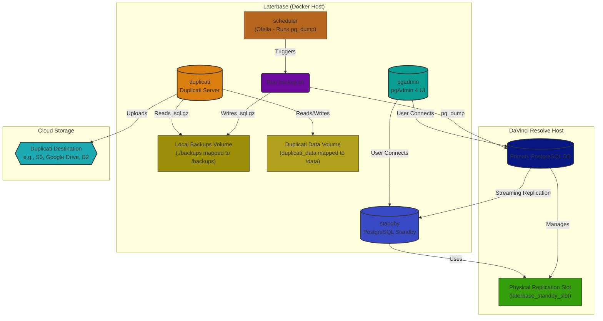

# Laterbase: DaVinci Resolve PostgreSQL Standby, Backup Agent, and pgAdmin Setup

Laterbase, sets up a Docker-based environment specifically designed for **DaVinci Resolve PostgreSQL databases**. It consists of:

1.  **PostgreSQL Standby Server:** Creates a hot standby replica of your primary DaVinci Resolve PostgreSQL database using streaming replication.
2.  **Hourly Backup Agent (`backup-agent`):** Performs hourly logical backups (`pg_dump`) of your primary DaVinci Resolve database(s) into a shared volume (`/backups`). Manages local `.sql.gz` file retention based on `BACKUP_RETENTION_DAYS`. Triggered by the `scheduler` service.
3.  **Duplicati Service (`duplicati`):** Runs the Duplicati server, monitoring the shared `/backups` volume (read-only). Uploads new/changed backup files to your configured cloud storage destination and manages remote retention according to its own job settings. Configured via its web UI.
4.  **pgAdmin 4 UI (`pgadmin`):** Provides a web-based graphical interface for managing and monitoring both the primary DaVinci Resolve database and the standby replica.
5.  **Scheduler (`scheduler`):** Uses Ofelia to trigger the `backup.sh` script inside the `backup-agent` container on an hourly schedule.
3.  **pgAdmin 4 UI:** Provides a web-based graphical interface for managing and monitoring both the primary DaVinci Resolve database and the standby replica.

<p align="center">
  
</p>

## Architecture Overview

This diagram shows how the Laterbase components interact with your primary DaVinci Resolve PostgreSQL database:



**Note on Physical Replication Slot:** A physical replication slot (`laterbase_standby_slot` in this setup) is a feature on the primary PostgreSQL server. It ensures that the primary server retains the necessary transaction logs (WAL segments) required by the standby server, even if the standby disconnects temporarily. This prevents the standby from falling too far behind and needing a full resynchronization.

## Configuration
1.  **`.env` File:**
    *   Open the `.env` file.
    *   Set `PRIMARY_HOST` to the hostname or IP address of your main **DaVinci Resolve** PostgreSQL server.
    *   Set `REPL_PASSWORD` to the password for the `postgres` user (or your designated replication user) on the primary DaVinci Resolve server.
    *   **Crucially:** Set `PRIMARY_DBS` to a comma-separated list of the **actual names** of your main **DaVinci Resolve** database(s) on the primary server (e.g., `ResolveProjects`, `AnotherResolveDB`).
    *   Set `PGADMIN_EMAIL` to the email address you want to use for the pgAdmin login.
    *   Set `PGADMIN_PASSWORD` to the password you want for the pgAdmin login.
    *   Adjust `PRIMARY_PORT` or `PRIMARY_USER` if they differ from the defaults (5432, postgres).
    *   Optionally, uncomment and set `POSTGRES_USER`, `POSTGRES_DB`, or `PGDATA` under the "Standby Server Configuration" section to override the defaults used by the standby service.
    *   **Backup Agent & Duplicati Configuration:**
        *   Set `LOCAL_BACKUP_PATH` to the path on the host machine where the hourly `.sql.gz` backup files should be stored (default: `./backups`). This directory is mounted into both the `backup-agent` (writeable) and `duplicati` (read-only) containers as `/backups`.
        *   Set `BACKUP_RETENTION_DAYS` to the number of days you want to keep local `.sql.gz` backups in the `LOCAL_BACKUP_PATH` directory. This cleanup is done by the `backup.sh` script (run by the scheduler). Defaults to 7 if not set.
        *   Set `TZ` to the desired timezone for the Duplicati container (e.g., `Europe/London`, `America/New_York`, `Etc/UTC`).
        *   Optionally, uncomment and set `DUPLICATI_WEBSERVICE_PASSWORD` to password-protect the Duplicati Web UI.
        *   **Duplicati Job Configuration:** Cloud destination, remote retention, and schedule are configured via the Duplicati Web UI after starting the containers (see Usage section).

2.  **Primary PostgreSQL Server Preparation (`PRIMARY_HOST`):**

    *   **Ensure DaVinci Resolve Database is Accessible:** Make sure your DaVinci Resolve database is configured to allow network connections if Laterbase is running on a different machine. Check the DaVinci Resolve Project Server settings if applicable.
    *   **Primary Server Configuration Steps (macOS Example):**
        **VERY IMPORTANT:** Configuring the primary server involves **both** manual file editing and running an automated script. These steps **must** be completed on your **primary macOS server** (`PRIMARY_HOST`) *before* you attempt to start the main Laterbase Docker containers (`docker-compose up`). Laterbase only configures the standby replica; it does **not** automatically configure your primary server.

        **Step 1: Manually Edit `pg_hba.conf` (Requires `sudo` on Primary Server)**
            *   This step **must** be done manually on the primary server.
            *   Open `Terminal.app` on the primary Mac where DaVinci Resolve's PostgreSQL is running.
            *   **Find the `pg_hba.conf` file:** For a standard DaVinci Resolve installation on macOS, the path is usually:
                `/Library/Application Support/PostgreSQL/<VERSION>/data/pg_hba.conf`
                (Replace `<VERSION>` with your PostgreSQL version number, e.g., `13`. You can find it by running `ls "/Library/Application Support/PostgreSQL/"` in Terminal).
            *   **Edit the file:** Use `nano` with `sudo`:
                ```bash
                sudo nano "/Library/Application Support/PostgreSQL/<VERSION>/data/pg_hba.conf"
                ```
                (Again, replace `<VERSION>` with the correct number).
            *   **Add the replication line:** Add the following line to the end of the file. **Adjust the IP address/subnet (`192.168.1.0/24`)** to match the network of your Docker host running Laterbase, allowing it to connect. Use the correct `PRIMARY_USER` if it's not `postgres`.
                ```
                # Allow replication connections from the Laterbase Docker host
                host    replication     postgres        192.168.1.0/24         md5
                ```
            *   **Save and Exit:** Press `Ctrl+O`, then `Enter` to save. Press `Ctrl+X` to exit `nano`.

        **Step 2: Run the Preparation Script (Requires Docker & `.env` on Laterbase Host)**
            *   This script automates granting replication privileges, creating the replication slot, and attempting a configuration reload via SQL.
            *   Ensure your `.env` file in the Laterbase project directory is correctly configured with `PRIMARY_HOST`, `PRIMARY_PORT`, `PRIMARY_USER`, and `REPL_PASSWORD`.
            *   From the Laterbase project directory (where `docker-compose.yml` is), run the script using `docker-compose run`:
                ```bash
                docker-compose run --rm --no-deps app bash /app/prepare_primary_db.sh
                ```
                *   `--rm`: Removes the temporary container after execution.
                *   `--no-deps`: Prevents starting linked services (like the standby DB itself).
                *   `app`: The service name defined in `docker-compose.yml` that has `psql` and the script.
            *   The script uses the `REPL_PASSWORD` from your `.env` file to connect.
            *   Review the script's output for any errors (e.g., connection refused, authentication failed).

        **Step 3: Manually Reload/Restart Primary PostgreSQL Server (on Primary Server)**
            *   **Crucial:** Changes to `pg_hba.conf` (Step 1) require the primary PostgreSQL server configuration to be reloaded or the server restarted. The script (Step 2) attempts `SELECT pg_reload_conf();`, but this **may not be sufficient** for `pg_hba.conf` changes or might fail due to permissions.
            *   You **must** ensure the configuration is reloaded on the primary server. Choose **one** of the following methods on the primary Mac:

                *   **Method A (Full Server Restart - Use if unsure):** If methods A or B don't work or you're unsure, a full restart of the Mac hosting the primary database will ensure the changes are applied, although it's less ideal.

                *   **Method B ** Quit and restart the **DaVinci Resolve Project Server** application. This usually restarts the underlying PostgreSQL server gracefully.

        **Step 4: Verify Primary Server is Running**
            *   After reloading/restarting, ensure your primary PostgreSQL server (and the DaVinci Resolve Project Server application, if used) is running and accessible before proceeding to start the Laterbase services.

3.  **Create Backup Directory:**
    *   In the same directory as the `docker-compose.yml` file on your Docker host, create the backups directory (if using the default `LOCAL_BACKUP_PATH`):
        ```bash
        mkdir backups
        ```

4.  **(Removed)** Rclone configuration is no longer needed. Duplicati is configured via its Web UI.

## Usage

1.  **Build and Start Containers:**
    *   Navigate to the project directory in your terminal.
    *   Run:
        ```bash
        docker-compose up --build -d
        ```
2.  **Access pgAdmin:**
    *   Open `http://<your-docker-host-ip>:5050` (or `http://localhost:5050`).
    *   Log in using the email/password from `.env`.
3.  **Access Duplicati:**
    *   Open `http://<your-docker-host-ip>:8200` (or `http://localhost:8200`).
    *   If you set `DUPLICATI_WEBSERVICE_PASSWORD` in `.env`, you'll need to log in.
4.  **Configure Duplicati Backup Job:**
    *   In the Duplicati UI (port 8200), click "Add backup".
    *   Choose "Configure a new backup" and give it a name (e.g., "Resolve DB Backups"). Set an encryption passphrase (recommended!).
    *   **Destination:** Select your cloud storage provider (Google Drive, S3, B2, etc.) and enter the required bucket/path and authentication details.
    *   **Source Data:** Navigate the folder tree and select the `/backups` directory (this is where `backup.sh` places the `.sql.gz` files inside the container).
    *   **Schedule:** Set how often Duplicati should check for new files and upload them (e.g., "Run daily at 3:00 AM"). Note that `backup.sh` creates new `.sql.gz` files hourly via the Ofelia scheduler. Duplicati will upload any new files found since its last run.
    *   **Options:** Configure remote retention (e.g., keep daily backups for 30 days). This is separate from the local `.sql.gz` retention (`BACKUP_RETENTION_DAYS` in `.env`).
    *   Save the backup job configuration. You can run it manually the first time if desired.
5.  **Connect Servers in pgAdmin:**
    *   Add a server connection for your **Primary** database (`PRIMARY_HOST`:5432). Use the user/password defined in `.env`.
    *   Add a server connection for your **Standby** database. Use these settings:
        *   **Host name/address:** `standby` (the service name in `docker-compose.yml`)
        *   **Port:** `5432` (the internal port)
        *   **Username:** `postgres` (or `PRIMARY_USER` from `.env`)
        *   **Password:** Use the *primary* server's password (`REPL_PASSWORD` from `.env`).
6.  **Monitor:**
    *   Use pgAdmin to monitor server status and replication lag.
    *   Check the Duplicati UI (port 8200) for backup job status, logs, and restore options.
    *   Check the `./backups` directory (or `LOCAL_BACKUP_PATH` from `.env`) on the host for hourly `.sql.gz` backup files.
    *   Check container logs: `docker logs standby`, `docker logs backup-agent`, `docker logs pgadmin`, `docker logs scheduler`.
7.  **Stop Containers:**
    *   Run:
        ```bash
        docker-compose down
        ```

## Files

*   `docker-compose.yml`: Defines the services (`standby`, `backup-agent`, `duplicati`, `pgadmin`, `scheduler`), their configurations, volumes, and network.
*   `app/Dockerfile`: Instructions to build the PostgreSQL standby server image (based on `postgres:15`).
*   `backup/Dockerfile.backup`: Instructions to build the `backup-agent` image (based on Debian, includes only `postgresql-client`).
*   `.env`: Configuration file for environment variables (database credentials, pgAdmin login, etc.). **Requires user configuration.**
*   `app/prepare_primary_db.sh`: **(New)** Script to automate granting replication role and creating the replication slot on the primary server via `psql`. Run manually before starting services.
*   `app/setup_standby.sh`: Script run inside the standby container on first start to perform the initial base backup and configure replication.
*   `backup/backup.sh`: Script run hourly (via Ofelia scheduler) inside the backup agent container to perform `pg_dump` backups into the `/backups` volume and manage local `.sql.gz` file retention.
*   `backup/entrypoint.sh`: (Removed/Unused) No longer needed for the simplified `backup-agent`.
*   `./backups/` (Directory to be created, or path set in `LOCAL_BACKUP_PATH`): Host directory where local backup files (`.sql.gz`) are stored by `backup-agent` and read by `duplicati`.
*   `duplicati_data` (Docker Volume): Stores Duplicati's configuration database and local state.
